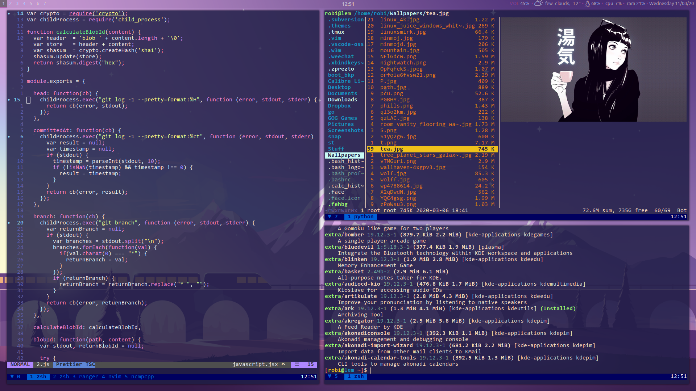
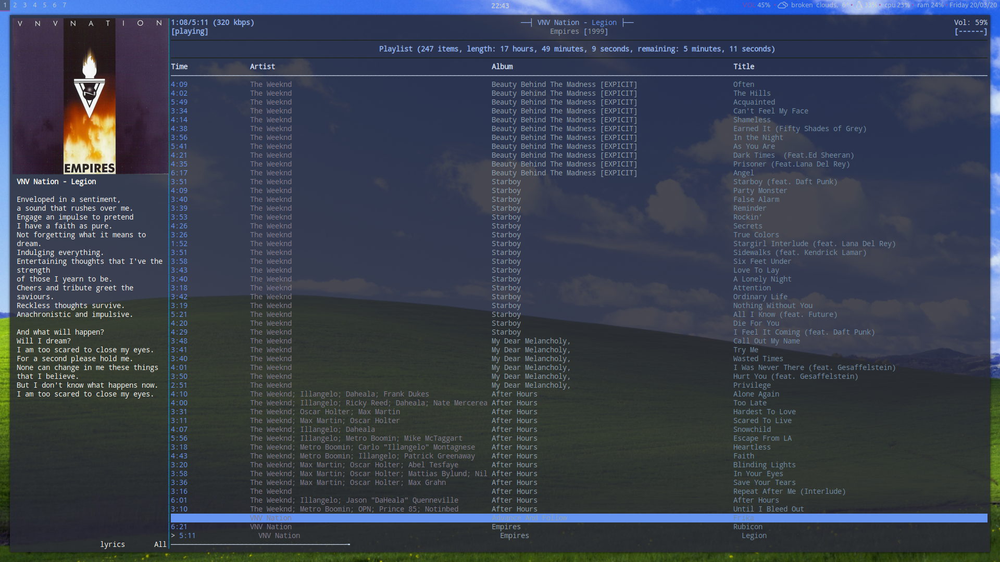

rupertobensi's dotfiles
=======================

In this repository I've gathered all of my essential dotfiles. Directory .local/bin contains scripts.
I use **i3** as my tiling window manager, and rest as follows:

* Shell: **zsh**
* Terminal emulator: **alacritty/st**
* Multiplexer: **tmux**
* Launchers: **dmenu2/rofi**
* Compositor: **picom**
* Text editor: **neovim**
* File manager: **ranger/vifm**
* Image viewer: **sxiv**
* Video player: **mpv**
* Music player: **ncmpcpp/cmus**

## Screenshots

*older variant with gaps:*

How to deploy this very setup?
------------------------------

I find GNU Stow to be the easiest program to help with it. Simply git clone this repo, cd into dotfiles and use command:

`$ stow .`

This then will create symlinks in the same architecture as my dotfiles.

[1]: https://github.com/sorin-ionescu/prezto
[2]: https://www.gnu.org/software/stow/
