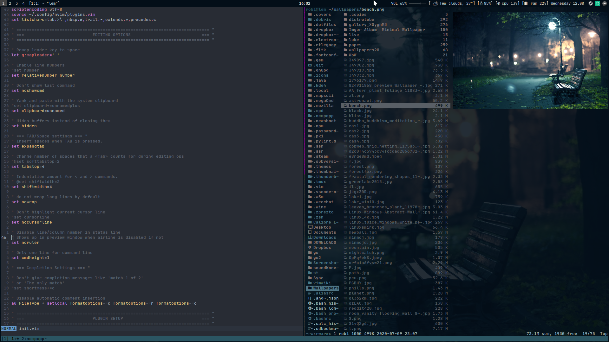
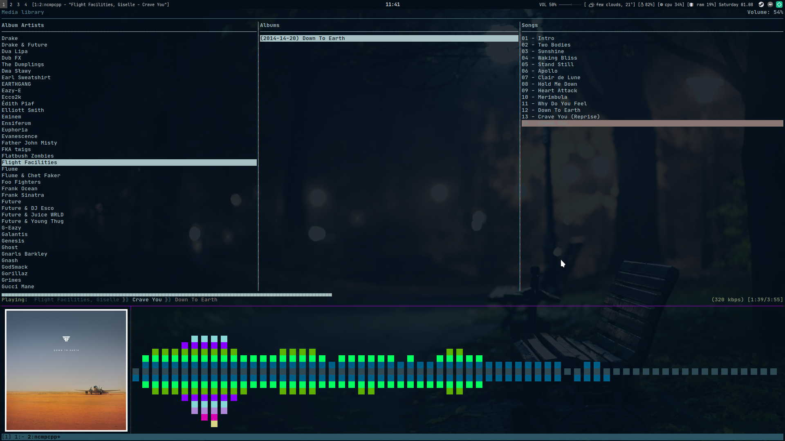

rupertobensi's dotfiles
=======================

In this repository I've gathered all of my essential .dotfiles. I use **i3** as my
tiling window manager, and rest as follows:

* Shell: **zsh**
* Multiplexer: **tmux**
* Launchers: **dmenu2 and rofi**
* Compositor: **tmux**
* Text editor: **neovim**
* File manager: **ranger**
* Image viewer: **sxiv**
* Video player: **mpv**
* Music player: **ncmpcpp**

How to deploy this very setup?
------------------------------

I've found GNU Stow to be the easiest program to help with it. Simply clone
these .dotfiles, cd into .dotfiles and use command:

`$ stow .`

This then will create symlinks in the same architecture as my .dotfiles.

[1]: https://github.com/sorin-ionescu/prezto
[2]: https://www.gnu.org/software/stow/
